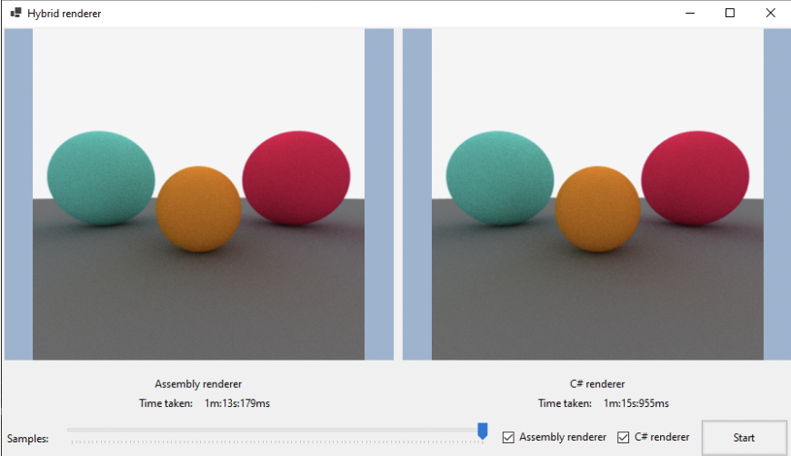

# ASMPT - Assembly accelerated Path Tracer.

## Description
Group project for **Assembly Programming Language** university course, written in **C#** and **x86 Assembly** using **MASM**.

- **Jakub Leśniak:** Frontend & DevOps,
- **Gracjan Jeżewski:** Rendering logic in C# and x86 Assembly,
- **Radosław Rzeczkowski:** Rendering logic in C# and x86 Assembly.

## Architecture
Basic version of the algorithm in higher level language (C#) with accelerated sphere intersection function using Assembly procedures. 
Implementation allows for direct comparison of individual execution times for hybrid and monolingual versions.

Project solution has a strictly defined order. 
Program can dynamically import the library when Assembly accelerated version of the algorithm should be performed. 
From our testing, it seems that DLL file is loaded once - the first time unsafe proxy method is used.

## Images

## Additional information
Project was made in accordance with the requirements of the subject. 
